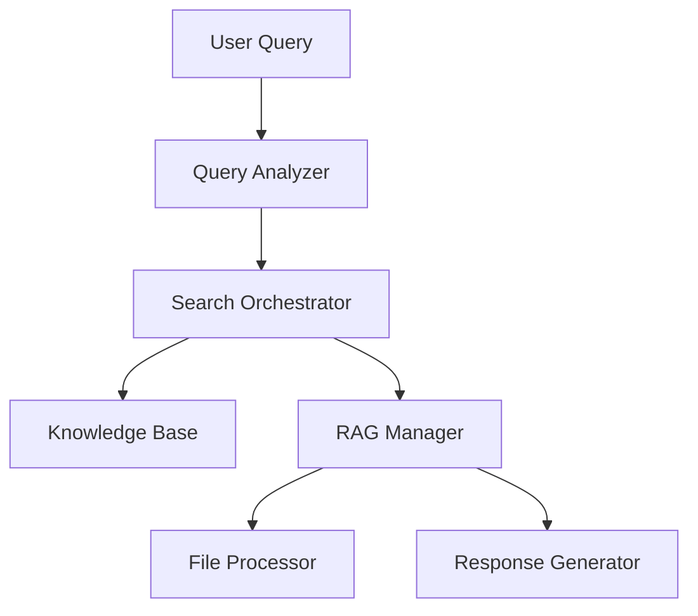
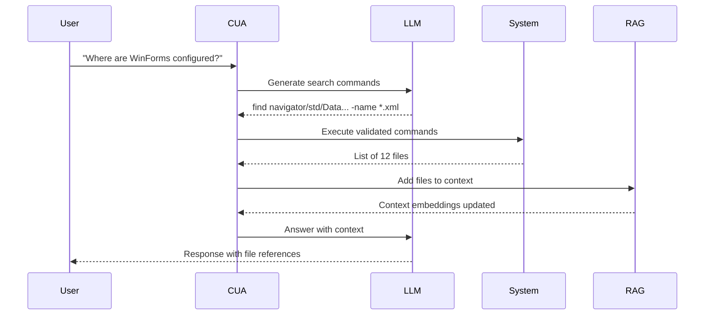

# Code Understanding Assistant (CUA) Design Document

## 1. Overview
**Problem**: Developers need contextual understanding of large codebases through natural language queries without full-code indexing  
**Solution**: LLM-guided search + Progressive RAG context building with domain knowledge integration

## 2. Key Objectives

1. Guided search using existing codebase knowledge
2. Targeted file retrieval with security constraints
3. Progressive context accumulation
4. Multi-stage verification pipeline
5. Extensible knowledge integration

## 3. System Architecture



## 4. Core Components

### 4.1 Knowledge Guidance System

- **Codebase Guidelines** (structured YAML)
  The Guidelines are the prompt to instruct LLM to how to search.


### 4.2 Search Orchestrator

- **LLM Command Generator**  
  Input: User query + Knowledge guidelines  
  Output: Validated find/grep commands

- **Command Validator**  
  - Security constraints  
  - Path allow-list verification

- **File Collector**  
  - Deduplication  
  - Priority sorting

### 4.3 Context Manager

| Component          | Responsibility               | Tech Stack              |
|--------------------|------------------------------|-------------------------|
| Dynamic VectorDB   | Maintain conversation context| FAISS + SentenceBERT    |
| Relevance Filter   | Remove outdated context      | Cosine Similarity       |
| Chunk Processor    | File → Searchable chunks     | Tree-sitter             |

## 5. Implementation Phases

### Phase 1: Core Infrastructure (Week 1-2)

- **Knowledge Base Loader**
  - YAML parser with schema validation
  - Priority path resolver

- **Command Generation Pipeline**

```python
class CommandGenerator:
    def generate(self, query: str) -> List[Command]:
        """Returns list of validated commands"""
        
    def validate(self, command: str) -> bool:
        """Check against allowed patterns"""
```

- **Base File Processor**
  - Safe file reading
  - Basic chunking (1024 tokens)
  - Extension-based filtering

### Phase 2: Search Enhancement (Week 3-4)

- **Hybrid Search Pipeline**  
  Ranking algorithm:  
  ```math
  score = 0.4*(path_priority) + 0.3*(keyword_match) + 0.3*(semantic_sim)
  ```

- **Security Layer**
  - Path allow-list
  - Command pattern validation
  - Timeout handling

### Phase 3: RAG Optimization (Week 5-6)

- **Adaptive Chunking**
  - Language-aware parsing
  - AST-based code segmentation

- **Context Pruning**
  - LRU cache strategy
  - Relevance decay function

## 6. Risk Mitigation

| Risk                      | Mitigation Strategy                     |
|---------------------------|-----------------------------------------|
| LLM generates unsafe cmds | Command validator with allow patterns   |
| Memory bloat              | Context pruning + Disk-backed FAISS     |
| Noisy search results      | Hybrid scoring + Manual override        |

## 7. Testing Strategy

- **Unit Test Suite**
  1. Command validation scenarios
  2. Chunking edge cases
  3. Priority scoring verification

- **Integration Tests**
  - End-to-end query resolution
  - Cross-session context persistence

## 8. Future Roadmap

1. **IDE Integration (Phase 4)**
   - VSCode extension
   - Real-time code awareness

2. **Team Knowledge Sharing (Phase 5)**
   - Shared context databases
   - Annotation system

## Appendix A: Example Workflow



## Appendix B: Non-Functional Requirements

- **Security**
  - Never execute raw user input
  - Maximum 5s command timeout

- **Performance**
  - <2s response for common queries
  - Support 100k file codebases
