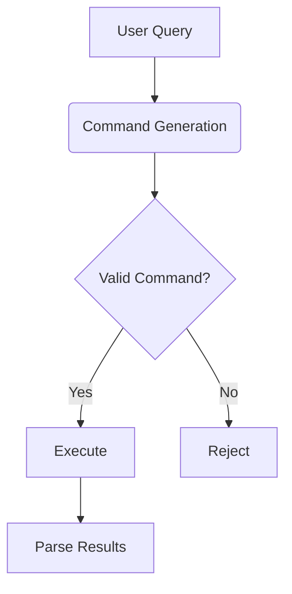

# Code Understanding System Test Strategy

## Test Cases for Command Generation



### Core Scenarios:
1. **Basic term search**  
   Query: "calculation"  
   Expected Commands:
   ```bash
   grep -r -Hn "calculation" --include=*.{cs,xml,run} 
   find . -name "*.cs" -exec grep -H "calculation" {} \;
   ```

2. **Multi-filetype search**  
   Query: "security reports"  
   Expected Patterns:
   ```bash
   rg --files -g '*.{cs,xml}' | xargs grep "security reports"
   ```

3. **Path depth constraints**  
   Should reject: `find / -name "*"` (exceeds max depth)

## Test Directory Structure

```bash
tests/
├── fixtures/
│   ├── navigator/... (mirror real paths)
│   └── test_files/
│       ├── calculation_test.cs
│       ├── security_report.xml
│       └── invalid_depth.run
└── validation/
    ├── command_validation_test.md
    └── rag_processing_test.md